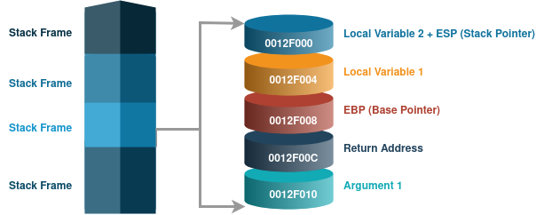
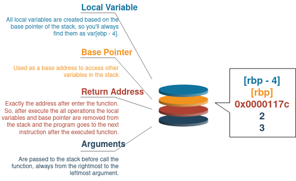

In this post our goal should be to learn how to recognize different type of variables, structs and operations in a disassembly code.

For to do the disassemble I'll work with [Radare](https://rada.re/n/), that is a great tool to reversing engineering and for practicality to use command line structured. But if you prefer you can use other tools like Cutter, x64dbg, objdump or other.

The idea here, is comparing a C code and show how we can assimilate the assembly code with it.

## Global x Local Variable

In this section, we'll cover how local and global variables are converted. Pay attention in:
- 'x' as a global variable, 
- 'y' as a constant global variable and 
- 'total' as a local variable.

I`ll always start each section with a piece of code that we'll use as base to analyse de assembly code.

```c
#include <stdio.h>

int x = 1;
const int y = 2;

void main(){
    int total = 0;
    total = x + y;
    printf("Total = %d\n", total);
}
```

Decompiling with Radare.

```r
[0x00001060]> s main
[0x00001149]> pd 17
            ;-- main:
            0x00001149      f30f1efa       endbr64
            0x0000114d      55             push rbp
            0x0000114e      4889e5         mov rbp, rsp                ; '\xff\xff\xff\xff\xff\xff\xff\xff'
            0x00001151      4883ec10       sub rsp, 0x10
            0x00001155      c745fc000000.  mov dword [rbp - 4], 0
            0x0000115c      8b05ae2e0000   mov eax, dword [obj.x]      ; '\xff\xff\xff\xff\xff\xff\xff\xff'
                                                                       ; [0x4010:4]=1
            0x00001162      ba02000000     mov edx, 2
            0x00001167      01d0           add eax, edx
            0x00001169      8945fc         mov dword [rbp - 4], eax    ; '\xff\xff\xff\xff\xff\xff\xff\xff'
            0x0000116c      8b45fc         mov eax, dword [rbp - 4]    ; '\xff\xff\xff\xff\xff\xff\xff\xff'
            0x0000116f      89c6           mov esi, eax                ; '\xff\xff\xff\xff\xff\xff\xff\xff'
            0x00001171      488d3d900e00.  lea rdi, str.Total___d_n    ; 0x2008 ; "Total = %d\n"
            0x00001178      b800000000     mov eax, 0
            0x0000117d      e8cefeffff     call sym.imp.printf
            0x00001182      90             nop
            0x00001183      c9             leave
            0x00001184      c3             ret
```

Before starting comparing, it's important to remember how functions are initialized in a stack, in our case the function main. So, pay attention in this stretch of code:

```
push rbp
mov rbp, rsp
sub rsp, 0x10
```

That's how the stack frame is created for this function, we start with the base pointer at the same place of the stack pointer, so the top and bottom of the stack are the same. And after that are allocated 0x10 (16) bytes / positions in the stack that will be used by the function.

Convertion table

|C|Disassembly Code|
|:---|:---|
|int x = 1;|mov eax, dword [obj.x]|
|cont int y = 2;|mov edx, 2|
|int total = 0;|mov dword [rbp - 4], 0|
|total = x + y;|add eax, edx<br>mov dword [rbp - 4], eax|
|printf("Total = %d\n", total);|mov esi, eax<br>lea rdi, str.Total___d_n<br>mov eax, 0<br>call sym.imp.printf|

With this table, we can verify that the global variables are referenced by memory address, and the local variable are referenced by the stack addresses.

|Variable type|Disassembly view|
|:---|:---|
|Global|mov eax, dword [obj.x]|
|Global constant|mov edx, 2|
|Local|mov dword [rbp - 4], 0|

Notice how 'total' variable is initialized, the number 4 is used because each address is 4 bytes in size because we are working with an int (sizeof(int) == 4).

The ESI and EDI registers are used in buffer data manipulation operations. ESI is the source index register, and EDI is the destination index register. If ECX appears, it is used as the counting variable.


The stack is used to store local variables, functions parameters, and the return address. Two registers are commonly used, ESP and EBP. ESP is the stack pointer and typically contains a memory address that points to the top of stack. It's value will change as items are pushed on and popped off the stack. The EBP is the base pointer that stays consistent within a given function, so that the program can use it as a placeholder to keep track of the location of a local variable and parameter. You will find it always as a base for local variables as [rbp - 4].

It's possible to read data from the stack without using the push or pop instructions. Fo example, the instruction mov eax, ss:[esp] will directly access the top of the stack.

With you find some of these register here, you can get some hits of the use if you remember the meaning of them.
- CS = Code Segment (used for IP)
- DS = Data Segment (used for MOV)
- ES = Destination Segment (used for MOVS, etc.)
- SS = Stack Segment (used for SP)


## Arithmetic Operations

Our C code will cover some basic operation of mathematics that are really common to find.

```c++
void main(){
    const int a = 2;
    int b = 3;
    int total = 0;

    b++;
    total = a + b;
    b--;
    total = b - a;
    total = a/b;
    b = a%b;
    total = a*b;
}
```

Decompiling with Radare.

```r
[0x00001129]> pd 26
            ;-- main:
            0x00001129      f30f1efa       endbr64
            0x0000112d      55             push rbp
            0x0000112e      4889e5         mov rbp, rsp                ; '\xff\xff\xff\xff\xff\xff\xff\xff'
            0x00001131      c745f4020000.  mov dword [rbp - 0xc], 2
            0x00001138      c745f8030000.  mov dword [rbp - 8], 3
            0x0000113f      c745fc000000.  mov dword [rbp - 4], 0
            0x00001146      8345f801       add dword [rbp - 8], 1
            0x0000114a      8b55f4         mov edx, dword [rbp - 0xc]  ; '\xff\xff\xff\xff\xff\xff\xff\xff'
            0x0000114d      8b45f8         mov eax, dword [rbp - 8]    ; '\xff\xff\xff\xff\xff\xff\xff\xff'
            0x00001150      01d0           add eax, edx
            0x00001152      8945fc         mov dword [rbp - 4], eax    ; '\xff\xff\xff\xff\xff\xff\xff\xff'
            0x00001155      8b45f8         mov eax, dword [rbp - 8]    ; '\xff\xff\xff\xff\xff\xff\xff\xff'
            0x00001158      2b45f4         sub eax, dword [rbp - 0xc]
            0x0000115b      8945fc         mov dword [rbp - 4], eax    ; '\xff\xff\xff\xff\xff\xff\xff\xff'
            0x0000115e      8b45f4         mov eax, dword [rbp - 0xc]  ; '\xff\xff\xff\xff\xff\xff\xff\xff'
            0x00001161      99             cdq
            0x00001162      f77df8         idiv dword [rbp - 8]
            0x00001165      8945f8         mov dword [rbp - 8], eax    ; '\xff\xff\xff\xff\xff\xff\xff\xff'
            0x00001168      836df801       sub dword [rbp - 8], 1
            0x0000116c      8b45f4         mov eax, dword [rbp - 0xc]  ; '\xff\xff\xff\xff\xff\xff\xff\xff'
            0x0000116f      99             cdq
            0x00001170      f77df8         idiv dword [rbp - 8]
            0x00001173      8955f8         mov dword [rbp - 8], edx    ; '\xff\xff\xff\xff\xff\xff\xff\xff'
            0x00001176      8b45f4         mov eax, dword [rbp - 0xc]  ; '\xff\xff\xff\xff\xff\xff\xff\xff'
            0x00001179      0faf45f8       imul eax, dword [rbp - 8]
            0x0000117d      8945fc         mov dword [rbp - 4], eax    ; '\xff\xff\xff\xff\xff\xff\xff\xff'
            0x00001180      90             nop
            0x00001181      5d             pop rbp
            0x00001182      c3             ret
```

As we expected, we start with 3 local variables in stack that are declared as:

```bash
mov dword [rbp - 0xc], 2 
mov dword [rbp - 8], 3
mov dword [rbp - 4], 0
```

Remember the multiples of 4 are used because all of our variable have 4 bytes in size, that is, they are integers.


|Operations in C|Disassembly Code|
|:---|:---|
|b++;|add dword [rbp - 8], 1|
|total = a + b;|mov edx, dword [rbp - 0xc]<br>mov eax, dword [rbp - 8]<br>add eax, edx<br>mov dword [rbp - 4], eax|
|total = b - a;|sub eax, dword [rbp - 0xc]<br>mov dword [rbp - 4], eax|
|b=a/b;|mov eax, dword [rbp - 0xc]<br>cdq<br>idiv dword [rbp - 8]<br>mov dword [rbp - 8], eax|
|b--;|sub dword [rbp - 8], 1|
|b = a%b;|mov eax, dword [rbp - 0xc]<br>cdq<br>idiv dword [rbp - 8]<br>mov dword [rbp - 8], edx|
|total = a*b;|mov eax, dword [rbp - 0xc]<br>imul eax, dword [rbp - 8]<br>mov dword [rbp - 4], eax|

The mul value instruction always multiples EAX by value. The result is stored as a 64-bit value across two registers, EDX:EAX. EDX stores the most significant 32/64 bits and EAX the stores the least significant 32/64 bits.

When performing the div or idiv instruction, you are dividing EDX:EAX by the value and storing the result in EAX and the remainder in EDX.

## Functions

Functions are one kind of scope that have the parameters and variables allocated in a stack to do local operations. This block of data is called stack frame, that count with respectively this item pushed into the stack: arguments, return address, EBP (Base Pointer), local variables and ESP (Stack Pointer), this last one always point to the top item in the stack.

||
|:---:|
|Stack Struct|


Our base code written in C.

```c++
int sum(int value1, int value2){
    return value1+value2;
}

void main(){
    int value = sum(2,3);
    printf("Value = %d", value);
}
```

Decompiling with Radare.

```r
[0x00001161]> pd 16
            ;-- main:
            0x00001161      f30f1efa       endbr64
            0x00001165      55             push rbp
            0x00001166      4889e5         mov rbp, rsp                ; '\xff\xff\xff\xff\xff\xff\xff\xff'
            0x00001169      4883ec10       sub rsp, 0x10
            0x0000116d      be03000000     mov esi, 3
            0x00001172      bf02000000     mov edi, 2
            0x00001177      e8cdffffff     call sym.sum
            0x0000117c      8945fc         mov dword [rbp - 4], eax    ; '\xff\xff\xff\xff\xff\xff\xff\xff'
            0x0000117f      8b45fc         mov eax, dword [rbp - 4]    ; '\xff\xff\xff\xff\xff\xff\xff\xff'
            0x00001182      89c6           mov esi, eax                ; '\xff\xff\xff\xff\xff\xff\xff\xff'
            0x00001184      488d3d790e00.  lea rdi, str.Value___d      ; 0x2004 ; "Value = %d"
            0x0000118b      b800000000     mov eax, 0
            0x00001190      e8bbfeffff     call sym.imp.printf
            0x00001195      90             nop
            0x00001196      c9             leave
            0x00001197      c3             ret
```


|Operations in C|Disassembly Code|
|:---|:---|
|int value = sum(2,3);|mov esi, 3<br>mov edi, 2<br>call sym.sum<br>mov dword [rbp - 4], eax|
|printf("Value = %d", value);|mov eax, dword [rbp - 4]<br>mov esi, eax<br>lea rdi, str.Value___d<br>mov eax, 0<br>call sym.imp.printf|

The parameters are pushed onto the stack from right to left, the stack is cleans up  when the function is complete, and the return value is stored in EAX.



## If Statements

To identify if statements, basically you'll need to understand this kind of code below.

```bash
cmp dst, src
jmp address
```

The cmp instruction is identical to the sub instruction, however the variables are not affected. The cmp instruction only set the flags: Zero Flag (ZF) and Carry Flag (CF). The result of this, is the base of operations in the if conditionals.

|cmp operations|ZF|CF|
|:---|:---:|:---:|
|dst = src|1|0|
|dst < src|0|1|
|dst > src|0|0|

Our base code written in C.

```c++
void main(){
    const int a = 2;
    int b = 3;
    
    if (a == b) {
        puts("a and b are equal\n");

        if(a > b) {
            puts("a > b");
        } else {
            puts("b > a");
        }
    } else {
        puts("a and b are different");
    }
}
```

Decompiling with Radare.

```r
[0x00001149]> pd 25
            ;-- main:
            0x00001149      f30f1efa       endbr64
            0x0000114d      55             push rbp
            0x0000114e      4889e5         mov rbp, rsp                ; '\xff\xff\xff\xff\xff\xff\xff\xff'
            0x00001151      4883ec10       sub rsp, 0x10
            0x00001155      c745f8020000.  mov dword [rbp - 8], 2
            0x0000115c      c745fc030000.  mov dword [rbp - 4], 3
            0x00001163      8b45f8         mov eax, dword [rbp - 8]    ; '\xff\xff\xff\xff\xff\xff\xff\xff'
            0x00001166      3b45fc         cmp eax, dword [rbp - 4]
        ┌─< 0x00001169      750e           jne 0x1179
        │   0x0000116b      488d3d920e00.  lea rdi, str.a_and_b_are_equal_n ; 0x2004 ; "a and b are equal\n"
        │   0x00001172      e8d9feffff     call sym.imp.puts
       ┌──< 0x00001177      eb2e           jmp 0x11a7
       │└─> 0x00001179      488d3d970e00.  lea rdi, str.a_and_b_are_different ; 0x2017 ; "a and b are different"
       │    0x00001180      e8cbfeffff     call sym.imp.puts
       │    0x00001185      8b45f8         mov eax, dword [rbp - 8]    ; '\xff\xff\xff\xff\xff\xff\xff\xff'
       │    0x00001188      3b45fc         cmp eax, dword [rbp - 4]
       │┌─< 0x0000118b      7e0e           jle 0x119b
       ││   0x0000118d      488d3d990e00.  lea rdi, str.a___b          ; 0x202d ; "a > b"
       ││   0x00001194      e8b7feffff     call sym.imp.puts
      ┌───< 0x00001199      eb0c           jmp 0x11a7
      ││└─> 0x0000119b      488d3d910e00.  lea rdi, str.b___a          ; 0x2033 ; "b > a"
      ││    0x000011a2      e8a9feffff     call sym.imp.puts
      └└──> 0x000011a7      90             nop
            0x000011a8      c9             leave
            0x000011a9      c3             ret
```

The local variables

```bash
mov dword [rbp - 8], 2
mov dword [rbp - 4], 3
```

|Operations in C|Disassembly Code|
|:---|:---|
|if (a == b)|mov eax, dword [rbp - 8]<br>cmp eax, dword [rbp - 4]<br>jne 0x1179|
|puts("a and b are equal\n");|lea rdi, str.a_and_b_are_equal_n<br>call sym.imp.puts|
|puts("a and b are different");|lea rdi, str.a_and_b_are_different<br>call sym.imp.puts|
|if(a > b)|mov eax, dword [rbp - 8]<br>cmp eax, dword [rbp - 4]<br>jle 0x119b|
|puts("a > b");|lea rdi, str.a___b<br>call sym.imp.puts|
|puts("b > a");|lea rdi, str.b___a<br>call sym.imp.puts|


|Common Instruction|Description|
|:---:|:---|
|jne|Jump if ZF is not set, that is ZF=0|
|jle|Jump after a cmp if the destination value is less than the source value|
|lea|"Load effective address", is used to put a memory address into the destination|
|jz or je|ZF = 1|
|jnz or jne|ZF=0|


## Loops

In this section you'll discover how practically not exist difference between kinds of loops, all have group of conditions and jump address.


### For

Our base code written in C.

```c++
void main(){
    for (int i = 0; i < 10; i++)
    {
        printf("%d\n", i);
    }  
}
```

Decompiling with Radare.

```r
[0x00001149]> pd 18
            ;-- main:
            0x00001149      f30f1efa       endbr64
            0x0000114d      55             push rbp
            0x0000114e      4889e5         mov rbp, rsp                ; '\xff\xff\xff\xff\xff\xff\xff\xff'
            0x00001151      4883ec10       sub rsp, 0x10
            0x00001155      c745fc000000.  mov dword [rbp - 4], 0
        ┌─< 0x0000115c      eb1a           jmp 0x1178
       ┌──> 0x0000115e      8b45fc         mov eax, dword [rbp - 4]    ; '\xff\xff\xff\xff\xff\xff\xff\xff'
       ╎│   0x00001161      89c6           mov esi, eax                ; '\xff\xff\xff\xff\xff\xff\xff\xff'
       ╎│   0x00001163      488d3d9a0e00.  lea rdi, [0x00002004]       ; "%d\n"
       ╎│   0x0000116a      b800000000     mov eax, 0
       ╎│   0x0000116f      e8dcfeffff     call sym.imp.printf
       ╎│   0x00001174      8345fc01       add dword [rbp - 4], 1
       ╎└─> 0x00001178      837dfc09       cmp dword [rbp - 4], 9
       └──< 0x0000117c      7ee0           jle 0x115e
            0x0000117e      90             nop
            0x0000117f      90             nop
            0x00001180      c9             leave
            0x00001181      c3             ret
```

|Operations in C|Disassembly Code|
|:---|:---|
|for (int i = 0; i < 10; i++)|mov dword [rbp - 4], 0<br>jmp 0x1178<br>cmp dword [rbp - 4], 9<br>jle 0x115e<br>mov eax, dword [rbp - 4]<br>add dword [rbp - 4], 1|
|printf("%d\n", i);|mov esi, eax<br>lea rdi, [0x00002004]<br>mov eax, 0<br>call sym.imp.printf|


### While

Our base code written in C.

```c++
void main(){
    int i = 10;
    while(i > 0) {
        i--;
    }
}
```

Decompiling with Radare.

```r
[0x00001129]> pd 12
            ;-- main:
            0x00001129      f30f1efa       endbr64
            0x0000112d      55             push rbp
            0x0000112e      4889e5         mov rbp, rsp                ; '\xff\xff\xff\xff\xff\xff\xff\xff'
            0x00001131      c745fc0a0000.  mov dword [rbp - 4], 0xa
        ┌─< 0x00001138      eb04           jmp 0x113e
       ┌──> 0x0000113a      836dfc01       sub dword [rbp - 4], 1
       ╎└─> 0x0000113e      837dfc00       cmp dword [rbp - 4], 0
       └──< 0x00001142      7ff6           jg 0x113a
            0x00001144      90             nop
            0x00001145      90             nop
            0x00001146      5d             pop rbp
            0x00001147      c3             ret
```

|Operations in C|Disassembly Code|
|:---|:---|
|int i = 10;|mov dword [rbp - 4], 0xa|
|while(i > 0)|jmp 0x113e<br>cmp dword [rbp - 4], 0<br>jg 0x113a|
|i--;|sub dword [rbp - 4], 1|


## Switch Case

From disassembly, it's almost impossible, to know whether the original code was a switch statement or a sequence of if and else.

```c++
void main(){
    int value = 0;

    switch (value)
    {
    case 1:
    case 2:
        printf("Option 1: %d",value);
        break;

    case 3:
        printf("Option 2: %d",value);
        break;
    
    default:
        printf("Default: %d",value);
        break;
    }
}
```

Decompiling with Radare.

```r
[0x00001149]> pd 34
            ;-- main:
            0x00001149      f30f1efa       endbr64
            0x0000114d      55             push rbp
            0x0000114e      4889e5         mov rbp, rsp                ; '\xff\xff\xff\xff\xff\xff\xff\xff'
            0x00001151      4883ec10       sub rsp, 0x10
            0x00001155      c745fc000000.  mov dword [rbp - 4], 0
            0x0000115c      837dfc02       cmp dword [rbp - 4], 2
        ┌─< 0x00001160      7f08           jg 0x116a
        │   0x00001162      837dfc00       cmp dword [rbp - 4], 0
       ┌──< 0x00001166      7f0a           jg 0x1172
      ┌───< 0x00001168      eb38           jmp 0x11a2
      ││└─> 0x0000116a      837dfc03       cmp dword [rbp - 4], 3
      ││┌─< 0x0000116e      741a           je 0x118a
     ┌────< 0x00001170      eb30           jmp 0x11a2
     ││└──> 0x00001172      8b45fc         mov eax, dword [rbp - 4]    ; '\xff\xff\xff\xff\xff\xff\xff\xff'
     ││ │   0x00001175      89c6           mov esi, eax                ; '\xff\xff\xff\xff\xff\xff\xff\xff'
     ││ │   0x00001177      488d3d860e00.  lea rdi, str.Option_1:__d   ; 0x2004 ; "Option 1: %d"
     ││ │   0x0000117e      b800000000     mov eax, 0
     ││ │   0x00001183      e8c8feffff     call sym.imp.printf
     ││┌──< 0x00001188      eb2f           jmp 0x11b9
     │││└─> 0x0000118a      8b45fc         mov eax, dword [rbp - 4]    ; '\xff\xff\xff\xff\xff\xff\xff\xff'
     │││    0x0000118d      89c6           mov esi, eax                ; '\xff\xff\xff\xff\xff\xff\xff\xff'
     │││    0x0000118f      488d3d7b0e00.  lea rdi, str.Option_2:__d   ; 0x2011 ; "Option 2: %d"
     │││    0x00001196      b800000000     mov eax, 0
     │││    0x0000119b      e8b0feffff     call sym.imp.printf
     │││┌─< 0x000011a0      eb17           jmp 0x11b9
     └└───> 0x000011a2      8b45fc         mov eax, dword [rbp - 4]    ; '\xff\xff\xff\xff\xff\xff\xff\xff'
       ││   0x000011a5      89c6           mov esi, eax                ; '\xff\xff\xff\xff\xff\xff\xff\xff'
       ││   0x000011a7      488d3d700e00.  lea rdi, str.Default:__d    ; 0x201e ; "Default: %d"
       ││   0x000011ae      b800000000     mov eax, 0
       ││   0x000011b3      e898feffff     call sym.imp.printf
       ││   0x000011b8      90             nop
       └└─> 0x000011b9      90             nop
            0x000011ba      c9             leave
            0x000011bb      c3             ret
```

|Operations in C|Disassembly Code|
|:---|:---|
|int value = 0;|mov dword [rbp - 4], 0|
|case 2:|cmp dword [rbp - 4], 2<br>jg 0x116a|
|case 3:|cmp dword [rbp - 4], 3|
|printf("Default: %d",value);|mov eax, dword [rbp - 4]<br>mov esi, eax<br>lea rdi, str.Default:__d<br>mov eax, 0<br>call sym.imp.printf|


## Arrays

In assembly, arrays are accessed using a base address as starting point. The size of each item isn't explicit, but we can discovery seeing how the array is being indexed.

```c++
void main(){
    int ip_address[] = {127,0,0,1};

    for (int i = 0; i < 4; i++)
    {
        printf("%d\n", ip_address[i]);
    } 
}
```

Decompiling with Radare.

```r
[0x00001169]> pd 30
            ;-- main:
            0x00001169      f30f1efa       endbr64
            0x0000116d      55             push rbp
            0x0000116e      4889e5         mov rbp, rsp                ; '\xff\xff\xff\xff\xff\xff\xff\xff'
            0x00001171      4883ec30       sub rsp, 0x30
            0x00001175      64488b042528.  mov rax, qword fs:[0x28]    ; '\xff\xff\xff\xff\xff\xff\xff\xff'
            0x0000117e      488945f8       mov qword [rbp - 8], rax    ; '\xff\xff\xff\xff\xff\xff\xff\xff'
            0x00001182      31c0           xor eax, eax
            0x00001184      c745e07f0000.  mov dword [rbp - 0x20], 0x7f ; '\x7f'
            0x0000118b      c745e4000000.  mov dword [rbp - 0x1c], 0
            0x00001192      c745e8000000.  mov dword [rbp - 0x18], 0
            0x00001199      c745ec010000.  mov dword [rbp - 0x14], 1
            0x000011a0      c745dc000000.  mov dword [rbp - 0x24], 0
        ┌─< 0x000011a7      eb20           jmp 0x11c9
       ┌──> 0x000011a9      8b45dc         mov eax, dword [rbp - 0x24] ; '\xff\xff\xff\xff\xff\xff\xff\xff'
       ╎│   0x000011ac      4898           cdqe
       ╎│   0x000011ae      8b4485e0       mov eax, dword [rbp + rax*4 - 0x20] ; '\xff\xff\xff\xff\xff\xff\xff\xff'
       ╎│   0x000011b2      89c6           mov esi, eax                ; '\xff\xff\xff\xff\xff\xff\xff\xff'
       ╎│   0x000011b4      488d3d490e00.  lea rdi, [0x00002004]       ; "%d\n"
       ╎│   0x000011bb      b800000000     mov eax, 0
       ╎│   0x000011c0      e8abfeffff     call sym.imp.printf
       ╎│   0x000011c5      8345dc01       add dword [rbp - 0x24], 1
       ╎└─> 0x000011c9      837ddc03       cmp dword [rbp - 0x24], 3
       └──< 0x000011cd      7eda           jle 0x11a9
            0x000011cf      90             nop
            0x000011d0      488b45f8       mov rax, qword [rbp - 8]    ; '\xff\xff\xff\xff\xff\xff\xff\xff'
            0x000011d4      644833042528.  xor rax, qword fs:[0x28]
        ┌─< 0x000011dd      7405           je 0x11e4
        │   0x000011df      e87cfeffff     call sym.imp.__stack_chk_fail
        └─> 0x000011e4      c9             leave
            0x000011e5      c3             ret
```

|Operations in C|Disassembly Code|
|:---|:---|
|int ip_address[] = {127,0,0,1};|mov rax, qword fs:[0x28]<br>mov qword [rbp - 8], rax<br>xor eax, eax<br>mov dword [rbp - 0x20], 0x7f<br>mov dword [rbp - 0x1c], 0<br>mov dword [rbp - 0x18], 0<br>mov dword [rbp - 0x14], 1|
|for (int i = 0; i < 4; i++)|mov dword [rbp - 0x24], 0<br>jmp 0x11c9<br>cmp dword [rbp - 0x24], 3<br>jle 0x11a9<br>add dword [rbp - 0x24], 1|
|printf("%d\n", ip_address[i]);|mov eax, dword [rbp - 0x24]<br>cdqe<br>mov eax, dword [rbp + rax*4 - 0x20]<br>mov esi, eax<br>lea rdi, [0x00002004]<br>mov eax, 0<br>call sym.imp.printf|

[COMPARAR COM OUTRO TIPO - EX: CHAR, DOUBLE]


## Struct

Structures are accessed with a base address used as a starting pointer.

```c++
struct book {
    int unit;
    char* title;
    double price;
};

void to_string(struct book* b){
    printf("Title: %s\nPrice: %f\nUnit: %d\n", b->title, b->price, b->unit);
}

void main(){
    struct book math;
    math.price = 50.5;
    math.title = "Math for dummies";
    math.unit = 5;
    to_string(&math);
}
```

Decompiling with Radare.

```r
[0x000011ab]> pd 22
            ;-- main:
            0x000011ab      f30f1efa       endbr64
            0x000011af      55             push rbp
            0x000011b0      4889e5         mov rbp, rsp                ; '\xff\xff\xff\xff\xff\xff\xff\xff'
            0x000011b3      4883ec20       sub rsp, 0x20
            0x000011b7      64488b042528.  mov rax, qword fs:[0x28]    ; '\xff\xff\xff\xff\xff\xff\xff\xff'
            0x000011c0      488945f8       mov qword [rbp - 8], rax    ; '\xff\xff\xff\xff\xff\xff\xff\xff'
            0x000011c4      31c0           xor eax, eax
            0x000011c6      f20f10056a0e.  movsd xmm0, qword [0x00002038] ; '\xff\xff\xff\xff\xff\xff\xff\xff'
                                                                       ; [0x2038:8]=0x4049400000000000
            0x000011ce      f20f1145f0     movsd qword [rbp - 0x10], xmm0 ; '\xff\xff\xff\xff\xff\xff\xff\xff'
            0x000011d3      488d054c0e00.  lea rax, str.Math_for_dummies ; 0x2026 ; "Math for dummies"
            0x000011da      488945e8       mov qword [rbp - 0x18], rax ; '\xff\xff\xff\xff\xff\xff\xff\xff'
            0x000011de      c745e0050000.  mov dword [rbp - 0x20], 5
            0x000011e5      488d45e0       lea rax, [rbp - 0x20]
            0x000011e9      4889c7         mov rdi, rax                ; '\xff\xff\xff\xff\xff\xff\xff\xff'
            0x000011ec      e878ffffff     call sym.to_string
            0x000011f1      90             nop
            0x000011f2      488b45f8       mov rax, qword [rbp - 8]    ; '\xff\xff\xff\xff\xff\xff\xff\xff'
            0x000011f6      644833042528.  xor rax, qword fs:[0x28]
        ┌─< 0x000011ff      7405           je 0x1206
        │   0x00001201      e85afeffff     call sym.imp.__stack_chk_fail
        └─> 0x00001206      c9             leave
            0x00001207      c3             ret
```

It's important to know that in this struct book, the size allocate for char* is the size of a address in your system 32 or 64 bits. So, if we wolud calculate the size needed for it is: int (4 bytes) + char* (8 bytes) + double (8 bytes) = 20 bytes.

|Operations in C|Disassembly Code|
|:---|:---|
|math.price = 50.5;|movsd xmm0, qword [0x00002038]<br>movsd qword [var_10h], xmm0|
|math.title = "Math for dummies";|lea rax, str.Math_for_dummies<br>mov qword [var_18h], rax|
|math.unit = 5;|mov dword [var_20h], 5|
|to_string(&math);|lea rax, [var_20h]<br>mov rdi, rax<br>call sym.to_string|


# Conclusion

In this post we learn how the variable, functions, and operations could be "translated" from C language to assembly. This knowledge is very useful to start to understand binary code and work with reverse engineering.